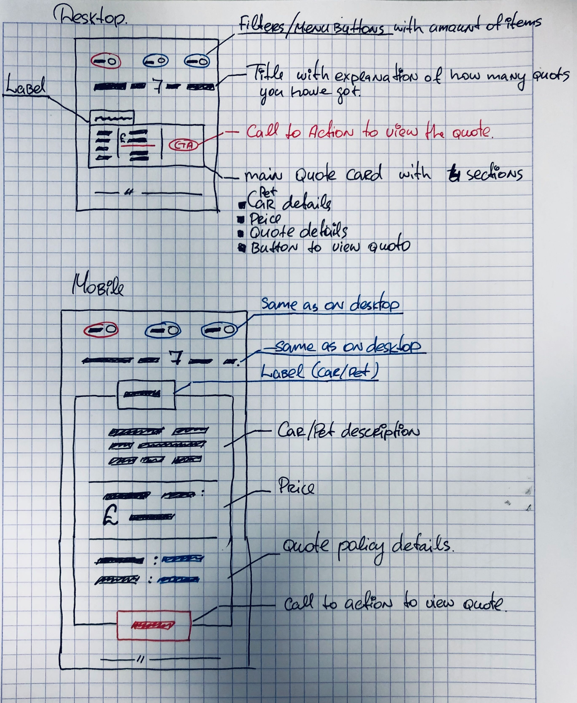

## [FE Coding Challenge]

This challenge is purely designed for you to demonstrate your Front-end abilities
to what you consider is a production ready code.

Before you start:

- There is no time constraints on this challenge.
- There is no restrictions on tech stack.
- Wireframe ("Design"), which we provide is just for you to get the idea of what is expected.
  It's not designed to dictate solution or look of your app.
  You are absolutely free to introduce your own view of how App should look like and be organised.

Requirements:

- Desktop & Mobile (responsive) App
- Consumes API (link here) for data
- Production ready code
- App should work and look as expected in all major browsers:
  - Chrome
  - Firefox
  - Safari
  - IE11+
  - Android Chrome
  - iOS Chrome/Safari

Task:
Build a simple app which consumes, handles and displays API data, with UI close to Wireframe provided.

- App is expected to have filters for what type of product. Ex. "Car", "Pet", "All"
- There should be counter of total quotes for current page view
- Each quote should be displayed as a card

Put anything you feel will help to understand and maintain your code.
Your solution should be ready for production environment deployment.
It is expected that we can clone & build your solution. If your submission requires more complex steps, then please provide the appropriate instruction

### Wireframe

